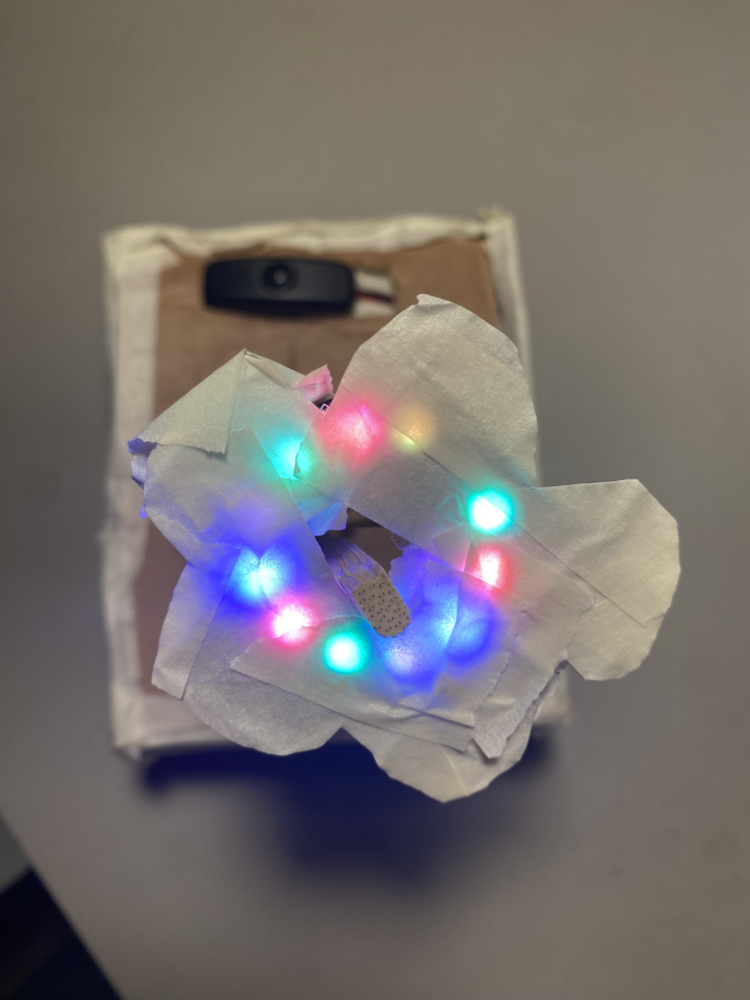

# DesertMediaArt_Genie

### Exercise 1 RGB blink: using Morse Code to test emotional response to the animations of different colors
The concept of the piece comes from my curiosity about messaging and communications. In another class, I recently learned about the layers of communication and that emotions, showing through facial expressions and body language, have been programmed in the human brain to be valued as 70% of the message and word counts towards the rest of the 30%. Morse Code is a way of communicating internationally. But it has strict rules of how it should be performed. There are rules regarding how long Dot (.) and Dash (-) are supposed to be performed, and even the space to be left in between has to be accurate. Otherwise, the words of the messages would not have been transmitted correctly. In this exercise, I am utilizing the LED light to speak to the audience in Morse Code in different colors and at different speeds. This exercise allows us to examine the emotional response that people have towards colors and tempo. 

### Prototype Exercise: Moody Flower
Project Idea / Concept:

The Moody Flower project idea comes from a plant that hates being touched. Once touched it will close up and only open up when it senses no environmental pressure nearby. It is called the Shameplant, or touch-me-not. Using a photocell sensor and a neopixel ring, I want to create a plant simulation that reacts to the environment. The Moody flower shows its mood based on colors, if it is within the brightness that it enjoys, the flower will have colors coming through. But if the environmental brightness is too dark or too bright, the flower will go dark completely. From another perspective, if a person is too close to it and blocks the light or takes a flashlight to shine on the flower, the flower will also show its mood by going dark. 

Interaction:

The environmental light and men-made brightness changes are the most important interaction factors in the project. Within the accepted brightness the flower will shine in beautiful lights, in an unwanted environment with too much or too little light the flower will go dark. If one puts their hand too close to the flower, the hand blocks the light, the flower will interact. And if one puts a light source too close to the flower, the flower will also respond.

